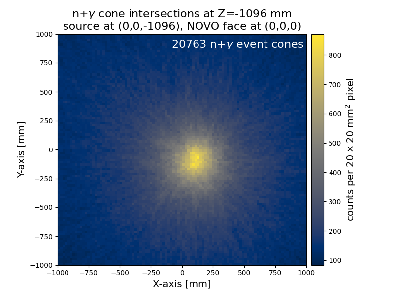
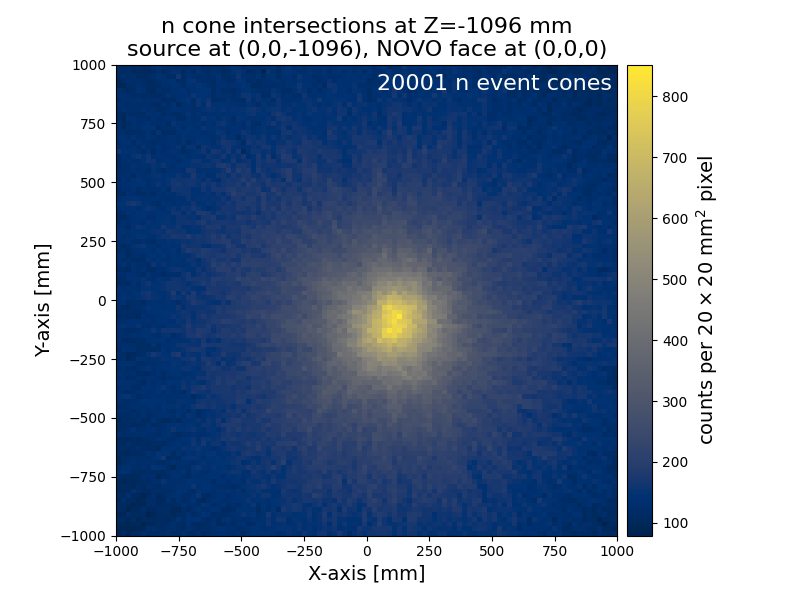
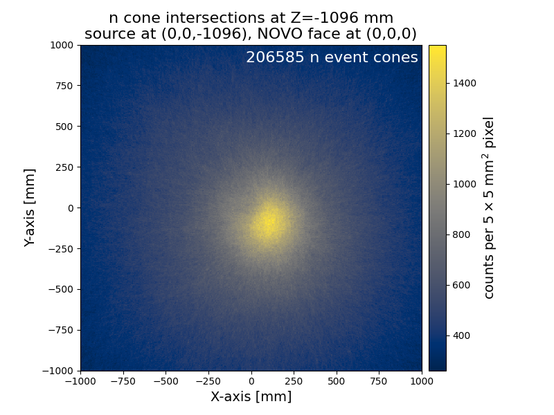
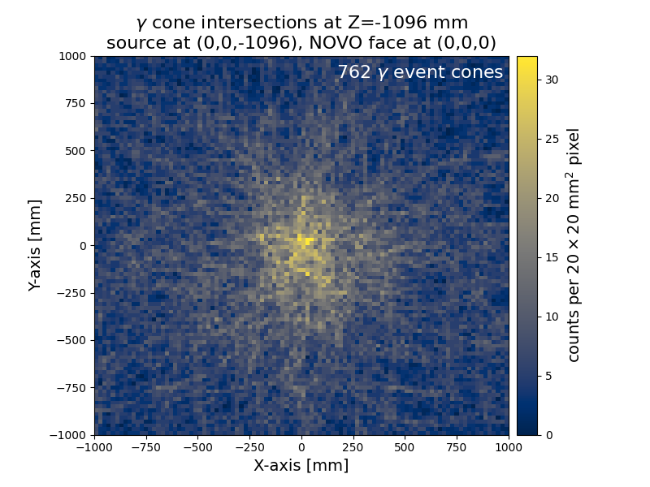
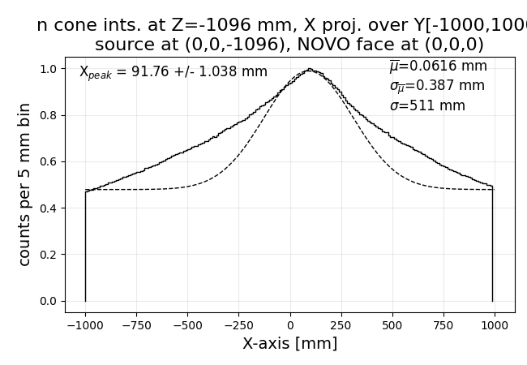
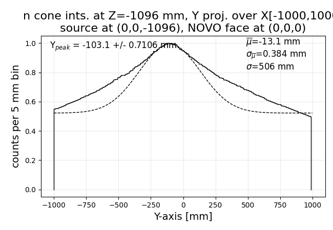

# Imaging NOVO experimental neutron data
## Neutrons from DT reaction at PTB

This example shows imaging of experimental data in the NOVO project, taken from measurements at the Physikalisch-Technische Bundesanstalt (PTB) Braunschweig in March 2024.  More information about the dataset from which this example is pulled can be found at: https://doi.org/10.14278/rodare.3827

The `autoSorted_coinc_detector_DT-14p8MeV_000041.root` file is produced by the acquisition processing chain and constitutes compiled events.  At the time, this is where the data handoff occurred, moving from construction of the physical quanta detected (hit light output, time, interaction coordinates, etc.) and found to be in coincidence to construction of event cones and their imaging (along with additional event/cone filtering).

In this particular run, from the detector array's frame of reference and the experimental coordinate system, the neutron source in this run is located at (x = 100 mm, y = -100 mm).  Though the produced image is quite smeared from experimental resolutions and uncertainties, it is clear that the imaged location is correct.

### ng-imager code processing

TO-DO

### Legacy code processing

To process this experimental data into cones then an image using the legacy code, it is executed as follows:

```commandline
python "legacy/expNOVO_imager_legacy.py" "examples/imaging_datasets/NOVO_experiment_DT_at_PTB/autoSorted_coinc_detector_DT-14p8MeV_000041.root" -s "examples/imaging_datasets/NOVO_experiment_DT_at_PTB/legacy_code/image_settings14.txt" -o "examples/imaging_datasets/NOVO_experiment_DT_at_PTB/legacy_code" -p 2 -f
```

Note that the settings file and output are all written to the `legacy_code` subdirectory.  The above command was executed twice, once with the `-f` "fast-mode" flag and once without.  Terminal output from the fast-mode execution of the legacy code has also been saved.

The outputs have been cleaned up/debloated a little bit (large `.pickle` files have been ZIP compressed; duplicate PDF versions of PNG plots have been deleted).  Note that all "fastmode" results either feature "fastmode" in their filenames and/or directory paths.  Owing to its huge (multi-GB) size, the list mode imaging data for the non-fastmode run is not included here.

The fastmode and full resolution neutron images are pictured below.  As we can see, the source is clearly shifted in the expected direction.  While difficult to discern from the image alone, projections of the neutron image onto the X and Y axes followed by peak fitting (pictured further below) allow for identification of the point source location, which indeed appears to be quite close to the actual experimental location of the source.  

_(Note: 2D centroid-locating techniques are better suited to this purpose, and a completely different imaging verification strategy is needed for non-point-source imaging.)_

<!--  /-->

Fastmode neutron image:



Full higher-resolution neutron image:




<!--   /-->



