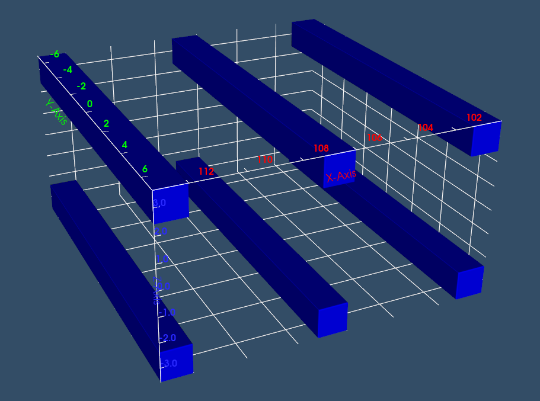
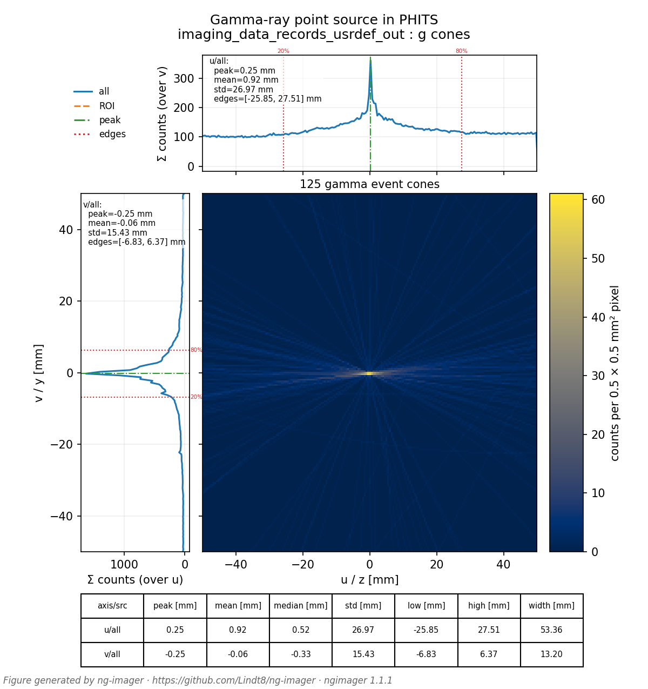

# Imaging PHITS-produced data
## Gamma-ray point source

The imaging dataset here was produced by running the PHITS input file `parallel_3d2t.inp` through PHITS using a combination of tally dump files to assemble coincident events, [method detailed in full here](https://dataverse.no/file.xhtml?persistentId=doi:10.18710/KBZZ9T/GSPMOC&version=1.0).

The geometry consists of six OGS bars, each measuring 1.2×1.2×14 cm³, arranged in a 3×2 pattern as pictured below, with 4.8 cm gaps between bars.  It is arranged such that the bars are oriented in the y direction and centered at y=0, vertically the two planes/layers of bars are centered at z=0, and the yz plane at x = 100 cm marks the start of the first pair of bars or "front face" of the detector array.  The detector cells are numbered 11,12,13, 21, 22, and 23.

The source is a point source of 2 MeV gamma rays (10^9 histories) at (0, 0, 0).  The output was compiled into events by a legacy processing code into the `imaging_data_records.pickle` file, which was then converted to the `usrdef` syntax expected by `ng-imager` with the [phits_legacy_2_usrdef.py](https://github.com/Lindt8/ng-imager/blob/main/src/ngimager/tools/phits_legacy_2_usrdef.py) script, resulting in `imaging_data_records_usrdef.out` with the three-fold gamma-ray coincident event data.  This file is then processed by `ng-imager`, where the gamma event cones are created and imaged, pictured below.

