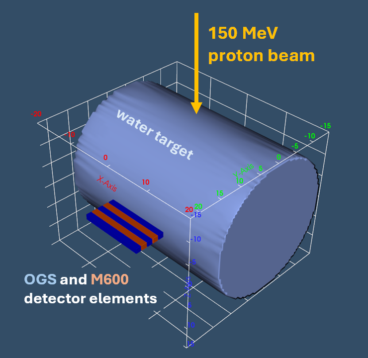

# Imaging PHITS-produced data

The imaging dataset here was produced by running the PHITS input file `novo-example.inp` through PHITS that had been recompiled with a custom user-defined tally ([T-Userdefined]) whose source and documentation can be found at: https://github.com/Lindt8/T-Userdefined/tree/main/multi-coincidence_ng

The example's geometry and source is pictured below (`geometry.png`).  It consists of a 150 MeV proton beam traveling in the +z direction (spawned at z = -50 cm) incident on a cylindrical water phantom (radius 15 cm, length 40 cm aligned along the x-axis), with 5 detector element cells (3 made of OGS—cells 200, 220, and 240—and 2 made of M600 plastic—cells 210 and 230), each measuring 1.2×1.2×14 cm³, placed adjacent to the target phantom (all parallel to the x-axis).  

The produced `usrdef.out` file from this tally contains two-fold neutron coincident and three-fold gamma-ray coincident event data, consisting of 121 total events (103 neutron and 18 gamma-ray).  This file is then processed by `ng-imager`, and the respective neutrons and gamma rays are imaged.  (For completeness, `usrdef_with-rxn-info.out` is also included; this was generated in an identical PHITS run but with `udtvar(10) = 1` set in the [T-Userdefined] tally section.)

