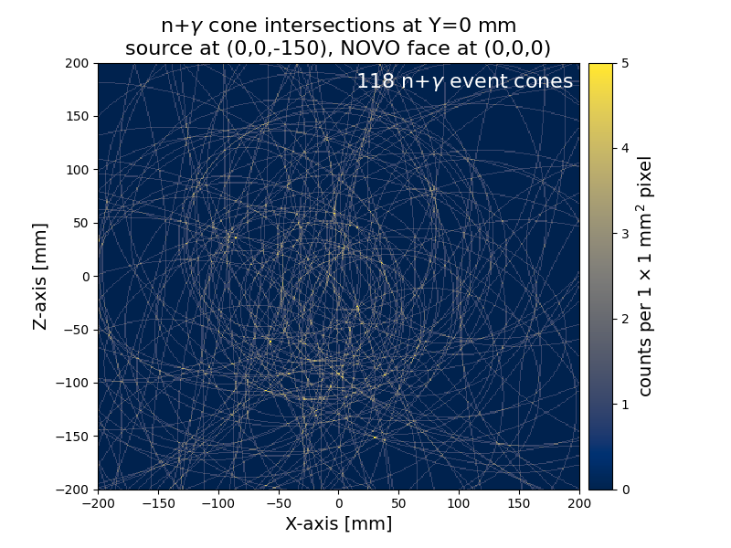
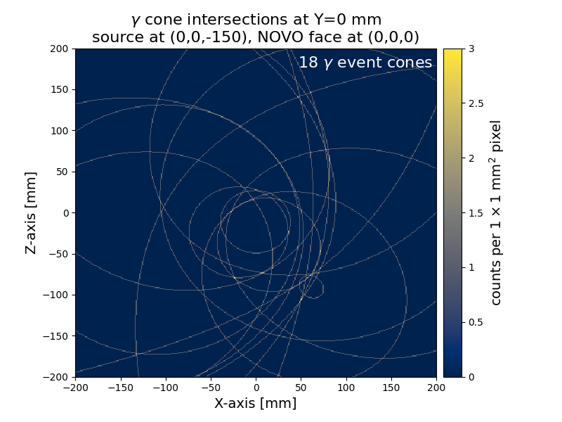
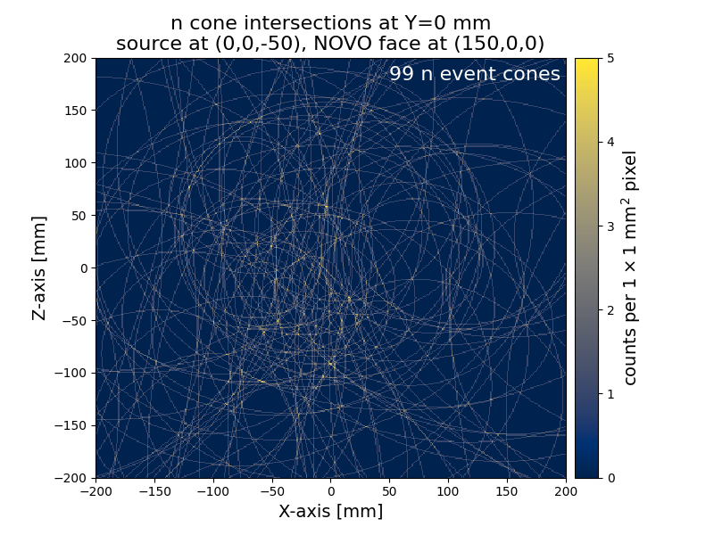

# _Legacy code_ imaging of PHITS-produced data

The imaging dataset here was produced by running the PHITS input file `../novo-example.inp` through PHITS that had been recompiled with a custom user-defined tally ([T-Userdefined]) whose source and documentation can be found at: https://github.com/Lindt8/T-Userdefined/tree/main/multi-coincidence_ng

The produced `../usrdef.out` file (copied to this directory) from this tally contains two-fold neutron coincident and three-fold gamma-ray coincident event data, consisting of 121 total events (103 neutron and 18 gamma-ray).  Here, the legacy imaging code is used for demonstration and comparison.

First, `usrdef.out` needs to be converted into the pickle format the imaging code expects:

```commandline
 python src/ngimager/tools/phits_usrdef_2_legacy.py examples/imaging_datasets/PHITS_simple_ng_source/legacy_code/usrdef.out
```

This produces the `imaging_data_records.pickle`. This file is then processed by the legacy imaging code, using the settings found in `image_settings.txt`.

```commandline
 python "legacy/expNOVO_imager_legacy.py" "examples/imaging_datasets/PHITS_simple_ng_source/legacy_code/imaging_data_records.pickle" -p 2
```

The imaging results (image, projections, etc.) are numerically stored in `imaging_data_records_results.pickle`, and the `imaging/` subdirectory contains the plotted results and "list-mode" imaging results.  The `terminal_output.txt` file shows what was written to the terminal during the running of the legacy imaging code when generating these results.

The final image, consisting of 100 imaged neutron cones and 18 gamma-ray cones, is pictured below.  Statistics are not adequate to paint a compelling picture, but it is at least obvious there is a higher concentration of cone-plane intersections around the line x=0 and in -150 mm < z < 50 mm.






