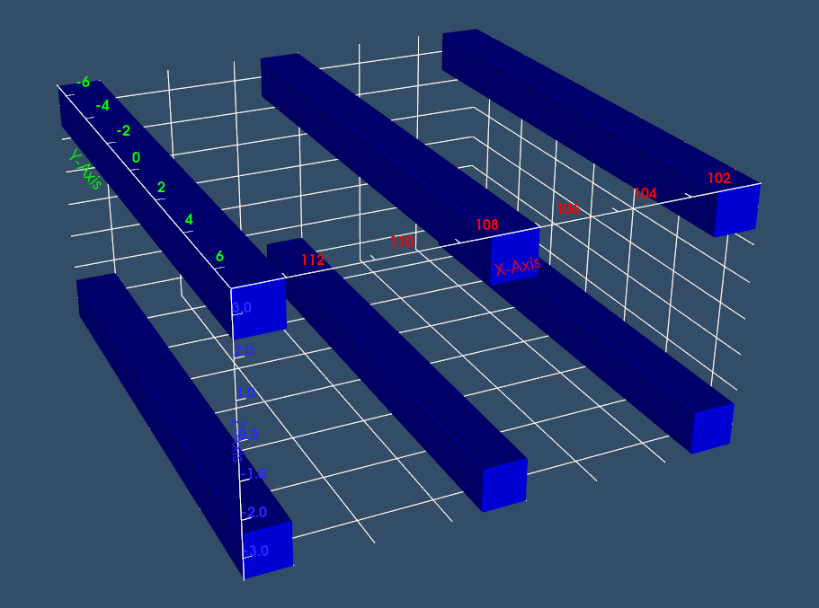
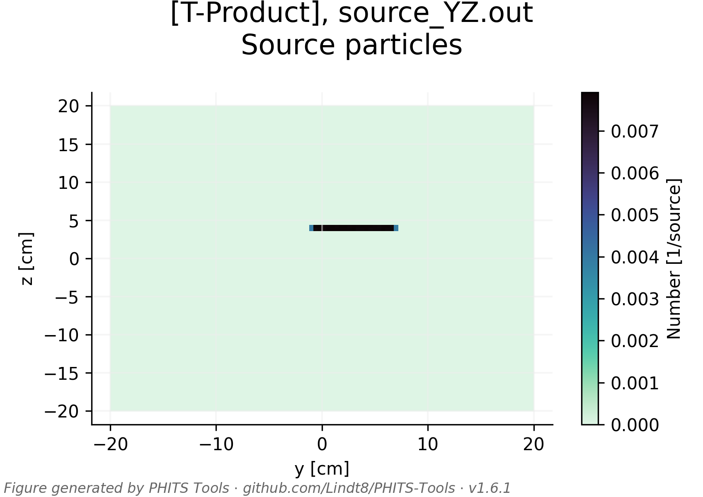

# Imaging PHITS-produced data
## Neutron line source

The imaging dataset here was produced by running the PHITS input file `parallel_3d2t.inp` through PHITS that had been recompiled with a custom user-defined tally ([T-Userdefined]) whose source and documentation can be found at: https://github.com/Lindt8/T-Userdefined/tree/main/multi-coincidence_ng

The geometry consists of six OGS bars, each measuring 1.2×1.2×14 cm³, arranged in a 3×2 pattern as pictured below, with 4.8 cm gaps between bars.  It is arranged such that the bars are oriented in the y direction and centered at y=0, vertically the two planes/layers of bars are centered at z=0, and the yz plane at x = 100 cm marks the start of the first pair of bars or "front face" of the detector array.  The detector cells are numbered 11,12,13, 21, 22, and 23.

The source is a "line source" of 14.1 MeV neutrons (10^7 histories).  It is centered at (0, 3 cm, 4 cm) and oriented along the y-axis, spanning from y=-1 to y=7 cm (with a 0.4 cm radius).

The produced `usrdef.out` file from this tally contains two-fold neutron coincident event data.  This file is then processed by `ng-imager`, where the neutrons event cones are created and imaged.  

